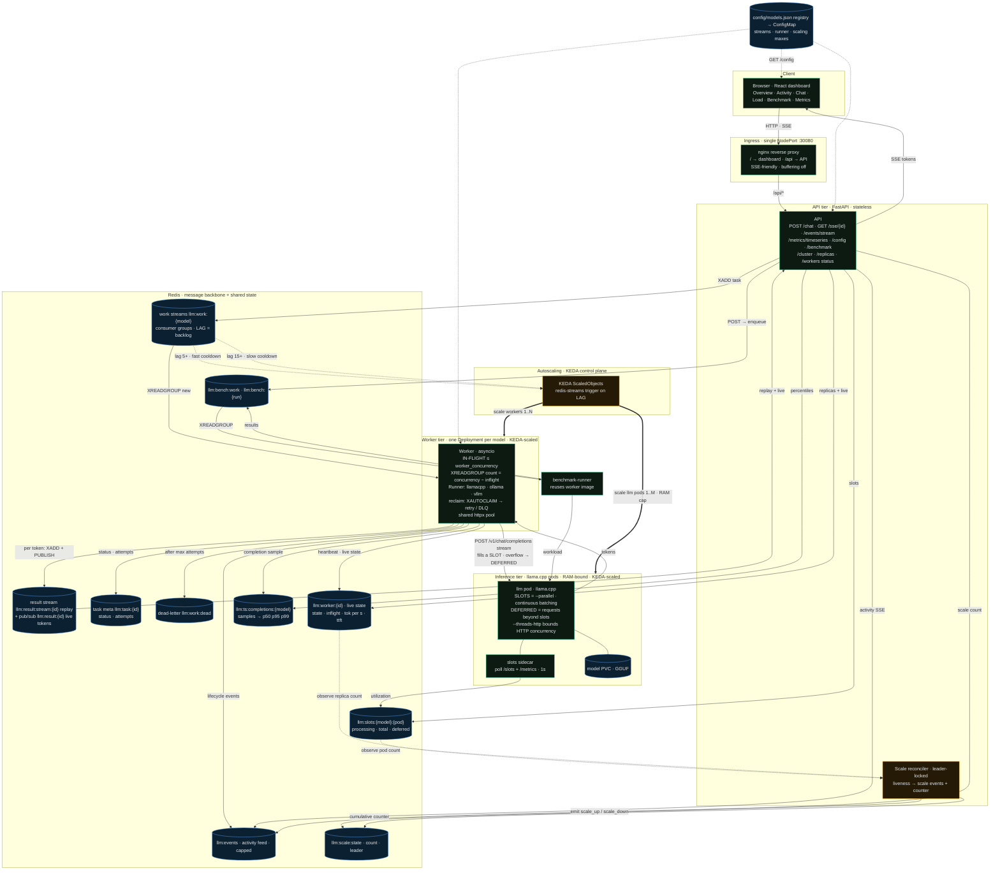
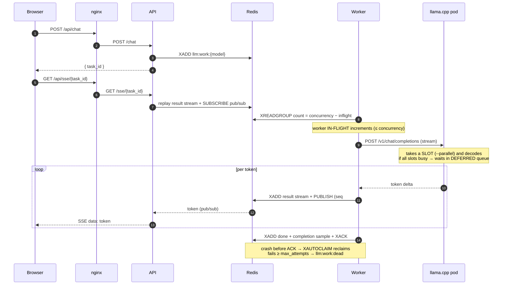

# System Architecture

Multi-model LLM serving platform: a durable Redis work queue decouples a
stateless API from stateless workers, which drive RAM-bound llama.cpp pods.
Two **independent** autoscalers (cheap workers, expensive model pods) both read
one signal — the work-queue **lag** — and the whole thing is observable in real
time. Backpressure is held in Redis (durable), never in llama.cpp's volatile
in-memory queue.

## Component & data-flow diagram

## Request lifecycle (one chat, streamed)

## Legend — the load-bearing concepts

| Concept | What it is | Where |
|---|---|---|
| **Redis work-queue LAG** | entries enqueued but not yet read by the consumer group = the **durable backlog**. The single autoscaling signal. | `llm:work:{model}` |
| **Worker IN-FLIGHT** | tasks one worker decodes concurrently (asyncio). Bounded by `worker_concurrency`; it pulls only `concurrency − inflight` per read, so excess stays in Redis. | `llm:worker:{id}.inflight` |
| **Pod SLOTS** | `--parallel` — requests llama.cpp decodes at once (continuous batching). | llama.cpp |
| **Pod DEFERRED** | requests a pod accepted but can't start (all slots busy) — its volatile in-memory queue. Kept ~0 by design. | `/metrics` → `llm:slots:*` |
| **Worker autoscaler** | KEDA on lag, low threshold + fast cooldown — cheap, stateless. | `keda.yaml` |
| **LLM-pod autoscaler** | KEDA on lag, high threshold + long cooldown — RAM-bound, slow to warm. | `keda.yaml` |
| **Slot (capacity) invariant** | `max_replicas × worker_concurrency ≤ max_llm_pods × parallel` → workers never oversubscribe slots; backlog lives in durable Redis, not llama.cpp. | `config/models.json` |
| **CPU-budget invariant** | `llm_args.threads == resources.llm.requests.cpu` → the k8s scheduler reserves exactly the cores a pod will burn, so overflow KEDA replicas stay `Pending` instead of thrashing CPU. Reserve ~¼ of cores for OS/k8s/redis/workers. See `diagrams/06-capacity-128gb.excalidraw` + `scaling-theory.md`. | `config/models.json` |
| **Resilience** | crash recovery via `XAUTOCLAIM`, retry with attempt tracking, `llm:work:dead` after N fails, SSE token dedup via seq numbers. | worker |
| **Real scale events** | a leader-locked reconciler watches replica counts via Redis liveness and emits real `scale_up`/`scale_down` (works for KEDA *and* `docker compose --scale`). | API |
| **Pluggable runner** | the backend wire protocol (llamacpp / ollama / vllm) behind one interface, selected per model; same harness benchmarks each. | `worker/runners/` |
| **Single source of truth** | the model registry drives streams, routing, scaling maxes, runner type for API + workers + dashboard. | `config/models.json` |
