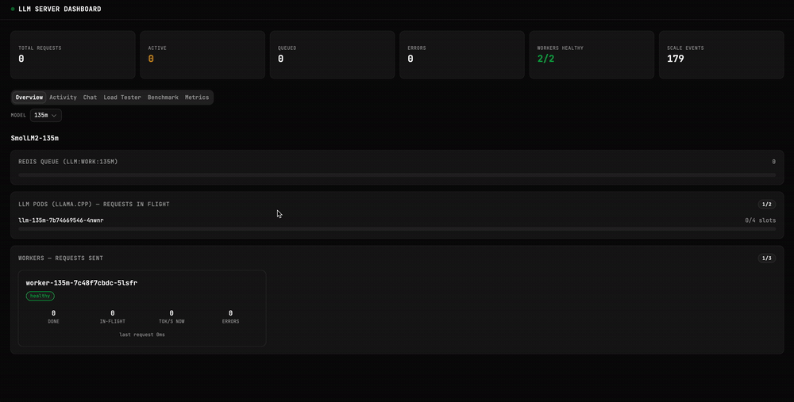
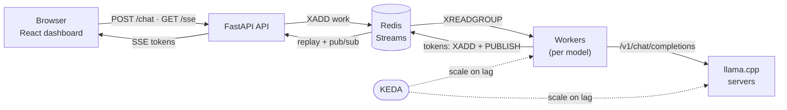
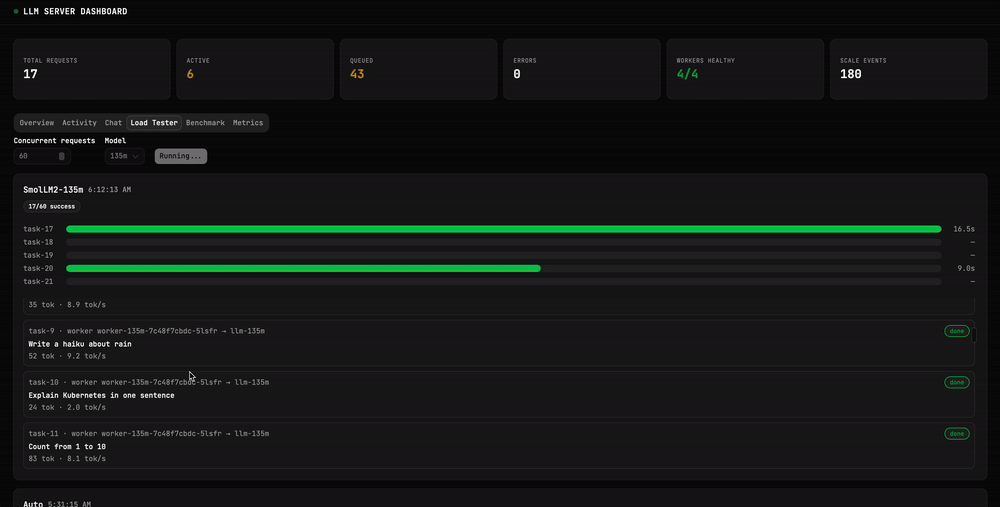

# llmux

[](https://github.com/mewehez/llmux/actions/workflows/ci.yml)
[](LICENSE)


> **Observable, autoscaling multi-model LLM serving on llama.cpp + Redis Streams, with SSE token streaming and a live React dashboard. Runs on Docker Compose and Kubernetes (kind) via KEDA + Helm.**



`llmux` serves multiple LLMs behind one API, streams tokens to the browser as they're generated, and shows in real time what every model and worker is doing. A durable Redis Streams work queue decouples a stateless API from stateless workers that drive RAM-bound llama.cpp pods — and **two independent autoscalers** (cheap workers, expensive model pods) scale each tier on queue lag. The entire model set, app wiring, and infrastructure are generated from **one registry file**.

---

## Highlights

- **Single source of truth** — `config/models.json` drives the app, the generated `docker-compose.yml`, and a registry-driven Helm chart. Adding or disabling a model is a one-line edit.
- **Real-time observability** — workers publish lifecycle events, live per-worker state, and completion time-series to Redis; the dashboard renders real percentiles, throughput, slot utilisation, and an activity feed (no mock data).
- **Two-tier autoscaling** — KEDA scales workers and llm pods independently on Redis Stream **lag**; a leader-locked reconciler emits real `scale_up`/`scale_down` events.
- **Pluggable runners** — the backend wire protocol (llama.cpp / Ollama / vLLM) sits behind one interface, selected per model, and the same harness **benchmarks** each.
- **Resilient by design** — durable streams + consumer groups, `XAUTOCLAIM` crash recovery, retry with attempt tracking, dead-letter queue, and SSE token dedup.
- **Tested & CI-gated** — 50 hermetic tests (fakeredis), plus lint/build/helm-lint and a generated-file drift guard on every push.

## Architecture



Late SSE clients **replay** missed tokens from a per-task stream, while live clients get push via **pub/sub** — the dual mechanism means no token is lost on a slow or reconnecting browser. See [docs/ARCHITECTURE.md](docs/ARCHITECTURE.md) for the detailed diagram, [docs/scaling-theory.md](docs/scaling-theory.md) for the replica/parallelism math, and [`docs/diagrams/`](docs/diagrams/) for the Excalidraw deep-dives.

## Quickstart (Docker Compose)

```bash
docker compose up -d          # first run downloads the GGUF model files
docker compose ps
```

| Service | URL |
|---|---|
| Dashboard | http://localhost:5173 |
| API | http://localhost:8000 |
| llama.cpp (135M / 360M) | http://localhost:8001 / 8002 |

```bash
# one-shot smoke test
curl -s localhost:8000/config | jq          # the served model registry
```

## Kubernetes (kind)

```bash
kind create cluster --name llm-server --config infra/k8s/kind-config.yaml
kubectl config use-context kind-llm-server

./infra/scripts/deploy-k8s.sh          # build images, load into kind, helm upgrade --install
# entrypoint (reverse proxy): http://localhost:30080
./infra/scripts/stop-k8s.sh            # tear down (keeps model PVCs)
```

k8s is deployed via a **Helm chart** (`infra/helm/llm-server/`) generated from `config/models.json`: per enabled model it renders a PVC, the llama.cpp Deployment (init container downloads the GGUF), a slots sidecar, a Service, a worker Deployment, and KEDA ScaledObjects.

## Choosing / adding models

The registry is the only place you edit:

```jsonc
// config/models.json
{ "id": "qwen3-8b", "enabled": false, "runner": "llamacpp",
  "model_url": "https://…/Qwen3-8B-Q5_K_M.gguf",
  "llm_args": { "ctx_size": 8192, "threads": 4, "parallel": 4 },
  "worker_concurrency": 4, "max_replicas": 4, "max_llm_pods": 4 }
```

Then regenerate the deploy artifacts:

```bash
make generate          # rebuild docker-compose.yml + sync the Helm registry copy
# …or for k8s:
./infra/scripts/deploy-k8s.sh
```

`stream` / `consumer_group` / `llm_url` are **derived** from `id`. Set `enabled: false` to stop serving a model (Helm prunes its resources; the API drops it from `/config`).

## Dashboard



A React + shadcn/ui dashboard with tabs for **Overview** (live queue depth, slots, replicas), **Chat** (SSE streaming), **Load Tester**, **Benchmark** (per-runner), **Activity** (the `llm:events` feed), and **Metrics** (real percentiles). Data is honest: `live` / `offline` states, never silent mock data.

## Project layout

```
api/            FastAPI — chat, SSE, /config, /metrics, /benchmark, scale reconciler
worker/         queue consumer · runners (llamacpp/ollama/vllm) · telemetry · benchmark
dashboard/      React + Vite + TypeScript + shadcn/ui
config/         models.json — the single source of truth (registry)
infra/helm/     registry-driven Helm chart
infra/k8s/      kind cluster config
infra/scripts/  deploy / stop scripts · docker-compose generator
docs/           ARCHITECTURE.md · scaling-theory.md · Excalidraw diagrams
```

## Development & testing

`api/` and `worker/` are [uv](https://docs.astral.sh/uv/)-managed Python 3.12 projects; `dashboard/` uses pnpm.

```bash
cd api    && uv run pytest        # API: helpers, enqueue, scale reconciler
cd worker && uv run pytest        # worker: resilience, telemetry, runners
make verify-generated             # fail if generated files drift from the registry
cd dashboard && pnpm lint && pnpm build
```

CI runs all of the above on every push and PR.

## Tech stack

**Backend** FastAPI · Redis Streams · llama.cpp · httpx · pydantic-settings ·
**Frontend** React 19 · Vite · TypeScript · shadcn/ui · Tailwind v4 ·
**Infra** Docker Compose · Kubernetes (kind) · Helm · KEDA · uv · pnpm

## License

[MIT](LICENSE) © Mewe-Hezoudah KAHANAM
